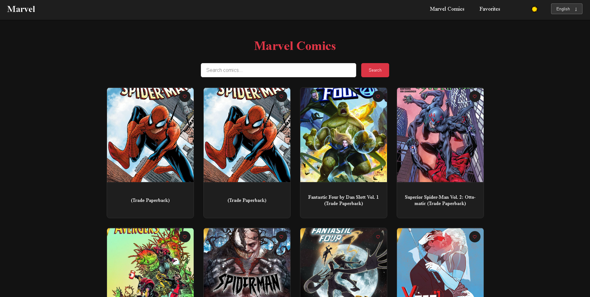
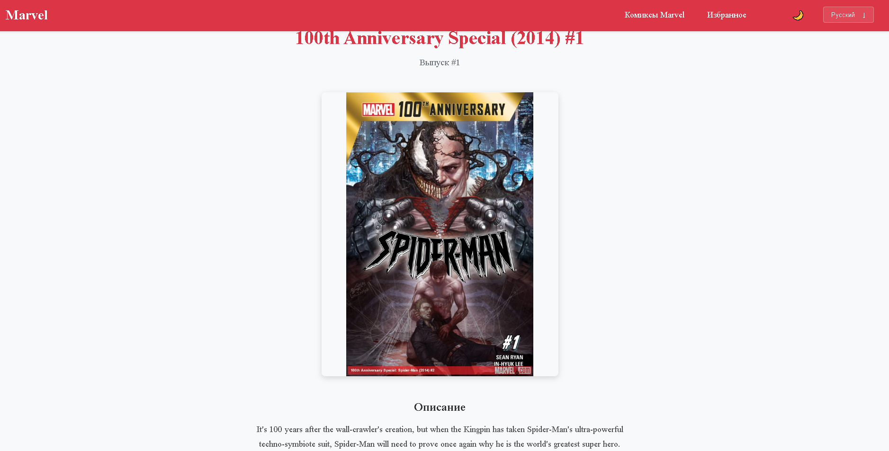
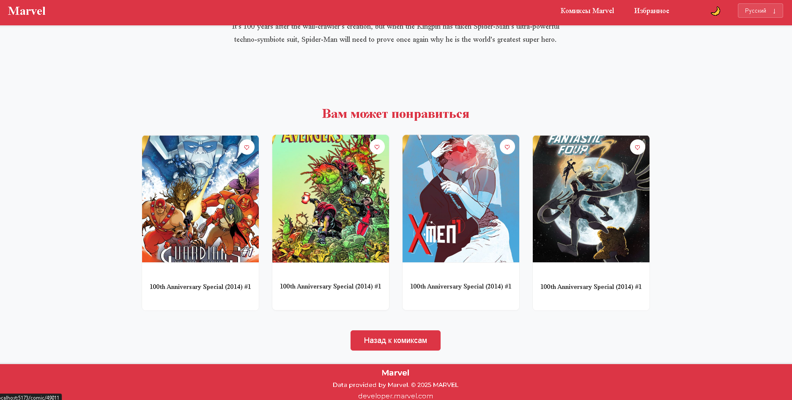
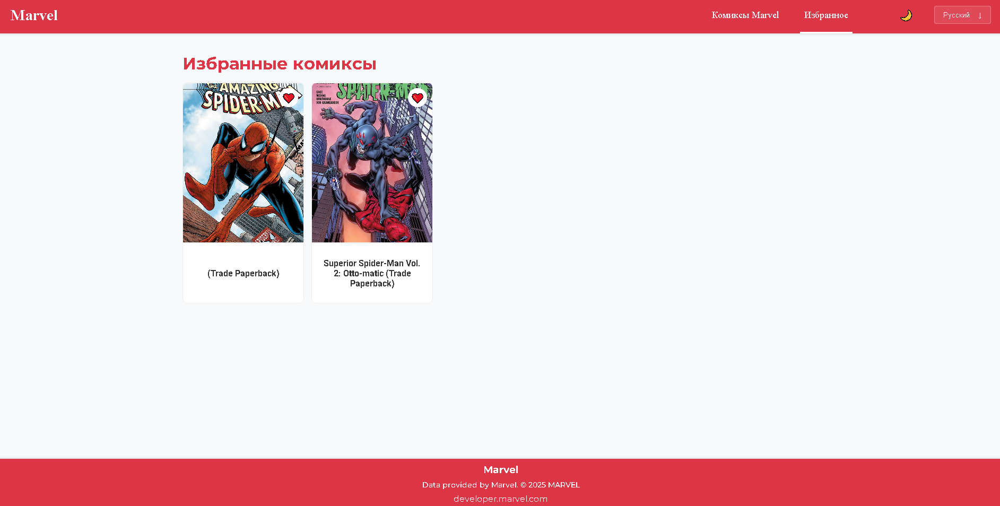

Marvel Comics
Приложение для просмотра комиксов Marvel с возможностью добавления в избранное и переключения тем.
Запуск приложения:
1. Установка зависимостей: npm install
2. Настройка окружения:
    Создайте файл .env в корне проекта и добавьте ваши ключи Marvel API:
        VITE_MARVEL_PUBLIC_KEY=your_public_key
        VITE_MARVEL_PRIVATE_KEY=your_private_key
3. Запуск в dev-режиме: npm run dev
4. Сборка для production:: npm run build
Возможности:
1. Просмотр комиксов: 
    - Список последних комиксов Marvel
    - Поиск по названию
    - бесконечная прокрутка
2. Детальная информация:
    - Просмотр описания комикса
    - Похожие комиксы
    - Добавление в избранное
3. Избранное:
    - Сохранение любимых комиксов
    - Просмотр списка избранного
    - Удаление из избранного
4. Настройки:
    - Переключение между светлой и темной темой
    - Поддержка двух языков (английский/русский)
Скриншоты:

  
  
  
  
  

Технологии:
React + TypeScript

Vite

MobX (стейт-менеджмент)

SCSS (стилизация)

React Router (навигация)

react-i18next (локализация)

Marvel API (данные комиксов)